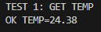

# Tests

## 1. Środowisko testowe

- Platforma: ESP32 DevKit
- Framework: ESP-IDF v5.x
- Czujnik: DS18B20 (1-Wire)
- Interfejsy:
  - UART (CLI, logi)
  - HTTP (Web UI)
- Tryb sieci: WiFi Access Point
- Narzędzia:
  - idf.py monitor
  - przeglądarka WWW (Chrome/Firefox)

---

## 2. Lista testów

### T1 – Start systemu i inicjalizacja FSM

**Cel:**  
Sprawdzenie poprawnej inicjalizacji systemu oraz przejścia FSM ze stanu INIT do IDLE.

**Kroki:**
1. Wgrać program na ESP32 (`idf.py flash`)
2. Uruchomić monitor portu szeregowego (`idf.py monitor`)

**Oczekiwany rezultat:**
- System uruchamia się bez błędów
- FSM przechodzi do stanu IDLE
- Brak komunikatów ERROR w logach

---

### T2 – Odczyt temperatury i średnia krocząca (STATE_RUN)

**Cel:**  
Sprawdzenie poprawności odczytu temperatury z czujnika DS18B20.

**Kroki:**
1. W terminalu CLI wysłać komendę `GET TEMP`
2. Odczytać wartość zwróconą w konsoli

**Oczekiwany rezultat:**
- W konsoli pojawił się komunikat z temperaturą

**Wynik**
`TEST 1: GET TEMP
OK TEMP=24.38`

---

### T3 – Interfejs CLI (GET / STAT)

**Cel:**  
Weryfikacja poprawności działania interfejsu CLI po UART poprzez test automatyczny.

**Kroki:**
1. Uruchomić skrypt test_cli.py za pomocą komendy `python test_cli.py`

**Oczekiwany rezultat:**
- CLI zwraca aktualną temperaturę
- CLI zwraca wartość średniej kroczącej
- CLI zwraca aktualny stan FSM
- Brak komunikatów `ERR UNKNOWN_CMD` dla poprawnych komend

**Wynik**
`TEST 1: GET TEMP`
`OK TEMP=24.38`

`TEST 2: GET AVG`
`OK AVG=24.38`

`TEST 3: STAT`
`STATE=1`

`ALL CLI TESTS PASSED`
!(T3)[T3.png]
---

### T4 – Web UI (HTTP)

**Cel:**  
Sprawdzenie poprawności działania serwera HTTP i strony WWW.

**Kroki:**
1. Połączyć się z siecią WiFi ESP32 (tryb AP)
2. Otworzyć w przeglądarce adres `http://192.168.4.1`
3. Obserwować stronę przez kilka sekund

**Oczekiwany rezultat:**
- Strona WWW ładuje się poprawnie
- Wyświetlana temperatura aktualizuje się cyklicznie
- Brak błędów HTTP

**Wynik**
!(T4)[T4.png]
---

### T5 – Obsługa błędu czujnika (FAULT → SAFE)

**Cel:**  
Sprawdzenie reakcji systemu na brak lub błąd czujnika DS18B20.

**Kroki:**
1. Odłączyć przewód danych (DQ) czujnika DS18B20
2. Obserwować logi UART

**Oczekiwany rezultat:**
- System wykrywa błąd czujnika
- FSM przechodzi do stanu FAULT, a następnie SAFE
- Pomiary temperatury zostają zatrzymane

---

